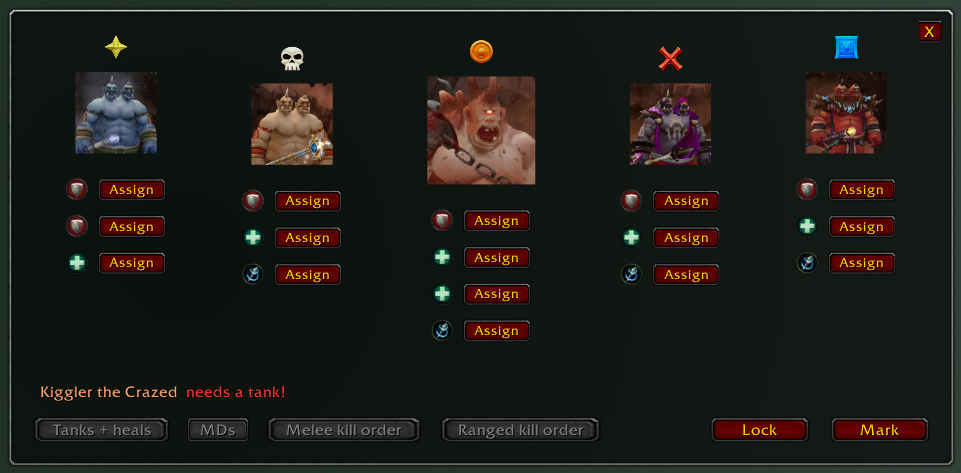
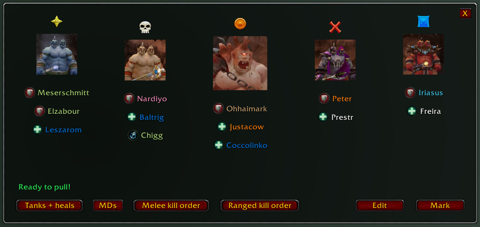

# Oh, hai Maulgar!

A World of Warcraft (2.4.3) addon for managing assignments
for **High King Maulgar** encounter in **Gruul's Lair** raid.

## Usage

Type: `/hkm`

**NOTE**: You must be in a raid group to be able to assign players.

## Live example

### Assignments

https://youtu.be/apkThl_6-7I?si=_jCCM7at_bsKR-XJ&t=7204

### Before the pull
https://youtu.be/apkThl_6-7I?si=5YpZRFaBUNLMBNBN&t=8008
